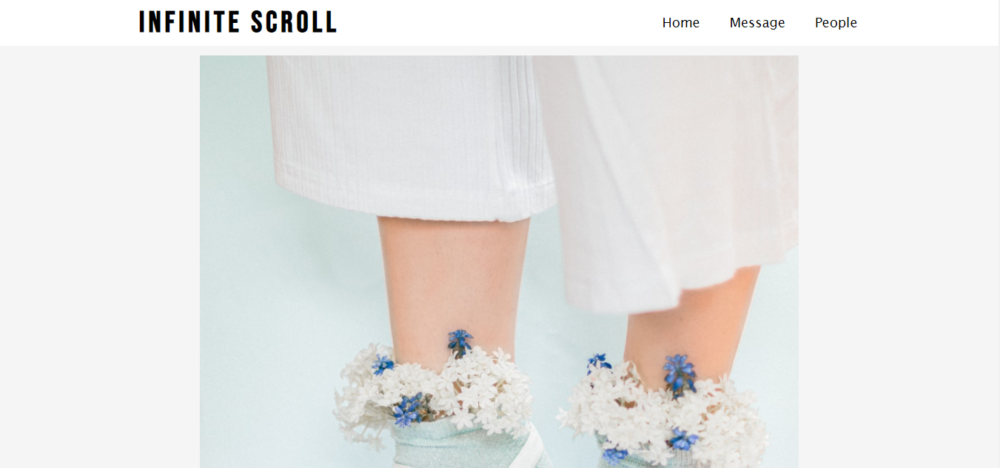

# Infinite-scroll
A simple web program that displays random images fetched from Unsplash API then rendered through the screen and whenever the screen hits near end vertically, it fetches more images.



### Clone repository
```bash
git clone https://github.com/kenhorlador/infinite-scroll.git
```